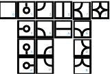

## Installation
This solver requires Python 3 and `numpy`.

To use the GUI you will need tkinter, the default python GUI library. On debian/Ubuntu: `sudo apt-get install python3-tk`).

Note: You can use the program without GUI with the flag `--nogui`, or `-n`.

## Use Examples

```
# print the help
$ .src/solver.py -h

# read the standard input (-s)
$ cat cadeau | .src/solver.py -s

# read the standard input and solve if fast (-f, ie GUI update only at the end), with arc-consistency (-a)
$ cat cadeau | .src/solver.py -sfa

# solve an example (-e, number between 0 and 4) and show all the steps (-p, voluntarily slow)
$ .src/solver.py -e 3 -p

# read the standard input, without GUI (-n) and with forward check (-c)
$ .src/solver.py -snc
```

## Démarche
J'ai choisi de coder tout le programme pour comprendre comment chaque élément fonctionne.

Je ne recherche pas qu'une ou deux solution mais je les recherches toutes.

L'arbre est modélisé par une pile Last In First Out qui permet de continuer l'exploration de l'arbre lorsque l'on rencontre
une impasse.

### Organisation du code
Le coeur du programme est dans la fonction `solver`.

## Résultats


## Misc
The shapes are :



Link to the [TP](http://www-desir.lip6.fr/~durrc/Iut/optim/t/dm1-connect).


